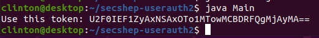

# User Authentication Challenge 2

Token generator for the User Authentication Challenge 2 in OWASP's Security Shepherd platform.

## Instructions

Method 1 is easy and method 2 is less easy.

### Method 1

Easiest way to run the program is using repl.it.

https://repl.it/@clintmint/userAuth2#Main.java

### Method 2

Clone it

```shell
cd
git clone https://github.com/clintmint/secshep-userauth2.git
cd secshep-userauth2
```

#### Linux Instructions

```
curl -o openjdk-14.0.2_linux-x64_bin.tar.gz https://download.java.net/java/GA/jdk14.0.2/205943a0976c4ed48cb16f1043c5c647/12/GPL/openjdk-14.0.2_linux-x64_bin.tar.gz
tar xf openjdk-14.0.2_linux-x64_bin.tar.gz

export PATH=$HOME/secshep-userauth2/jdk-14.0.2/bin/:$PATH
```

Verify version is 14

```shell
java -version
javac -version
```

Compile and Run

```shell
javac Main.java
java Main
```

Expected output




